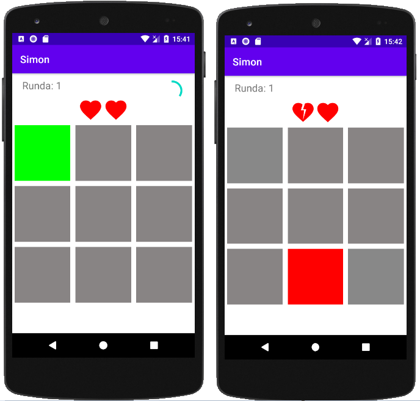
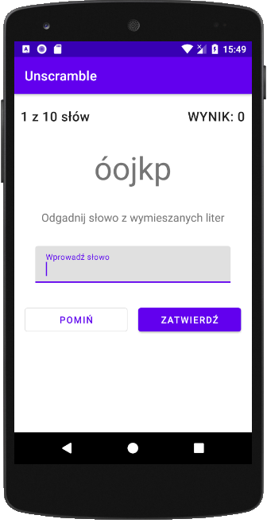
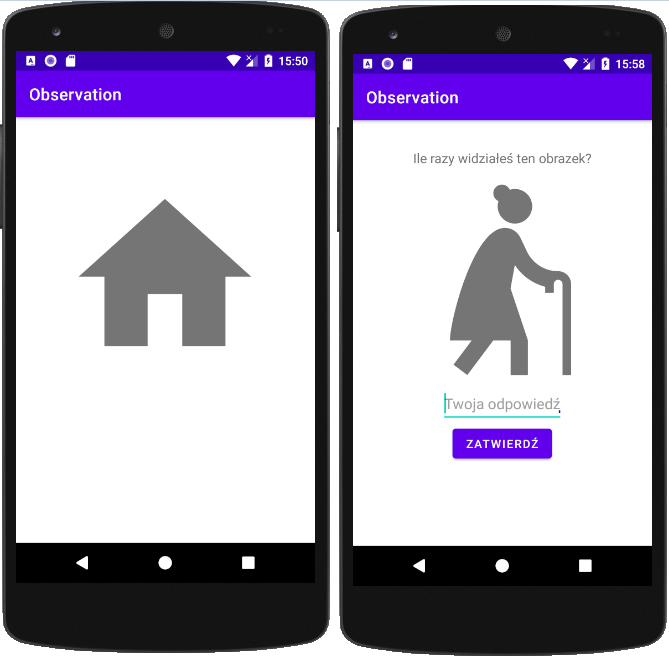
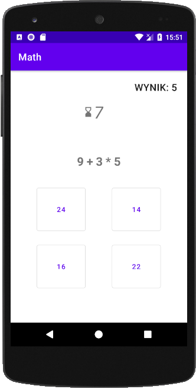
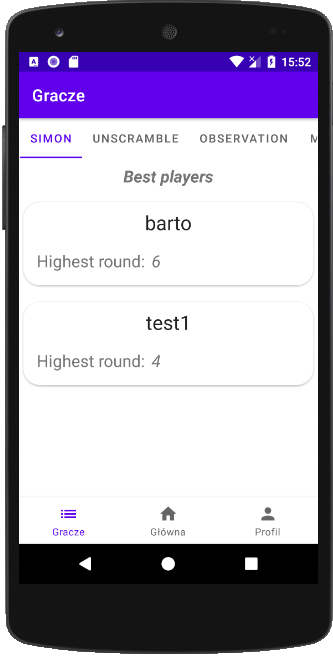

# About
TrainYourBrain is an Android application that requires you to strain your mind. It consists of a few, different games and allows you to beat your records in each one of them.

# Languages and Tools
* Kotlin
* Java
* Firebase Authentication
* Firebase Firestore Database

# Used components
* ViewModel
* ViewBinding
* Navigation

# Games
## Simon
Remember the sequence in which you have to press buttons. Each round the sequence is getting longer.

## Unscramble
Guess the word from shuffled words. Number of points you get depends on the length of the word.

## Observation
How many times have you seen an image shown at the end of the sequence of images?

## Math
Calculate the math operation and choose one answer out of four possible ones within 10 seconds.

# Best players

